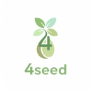

 
> [SKN14-Final-4Team-Web(Frontend Git Repo)](https://github.com/skn-ai14-250409/SKN14-Final-4Team-Web)
> &nbsp;&nbsp;&nbsp;&nbsp;&nbsp;&nbsp;&nbsp;&nbsp;&nbsp;&nbsp;&nbsp;&nbsp;
> [SKN14-Final-4Team-AI(Backend Git Repo)](https://github.com/skn-ai14-250409/SKN14-Final-4Team-AI)

# 🔎 문제 정의
- 온난화, 각국의 이상기후 등 `환경 문제에 대한 위기감 증가`

# 📌 시장 분석
- `기후감수성`              : 환경 문제에 대하여 2030 세대가 갖는 인식의 변화 [[ 출처 ]](http://news-j.co.kr/View.aspx?No=3489567)
- `지속가능 패션 시장 성장` : 글로벌 친환경 패션 시장 규모 2025년 13억 달러 → 2032년 53억 달러 전망 [[ 출처 ]](https://www.coherentmarketinsights.com/industry-reports/global-sustainable-fashion-market)
- `MZ세대 트렌드`           : 브랜드 충성도보다 가치소비·지속가능성을 우선시 [[ 출처 ]](https://www.k-trendynews.com/news/articleView.html?idxno=176226#:~:text=%5BKtN%20%EC%B5%9C%EC%9C%A0%EC%8B%9D%EA%B8%B0%EC%9E%90%5D%20MZ%EC%84%B8%EB%8C%80(%EB%B0%80%EB%A0%88%EB%8B%88%EC%96%BC+Z%EC%84%B8%EB%8C%80)%EA%B0%80%20%EC%86%8C%EB%B9%84%20%EC%8B%9C%EC%9E%A5%EC%9D%98%20%EC%A3%BC%EC%9A%94%20%EC%A3%BC%EC%B2%B4%EB%A1%9C,%EC%82%AC%ED%9A%8C%EA%B0%80%20%EC%A3%BC%EB%AA%A9%ED%95%B4%EC%95%BC%20%ED%95%A0%20%EB%B3%80%ED%99%94%EC%9D%98%20%ED%9D%90%EB%A6%84%EC%9C%BC%EB%A1%9C%20%EC%9E%90%EB%A6%AC%20%EC%9E%A1%EC%95%98%EB%8B%A4.)
- `패션+AI 융합`            : AI 기반 스타일 추천 시장과 ESG 경영 확산이 동시에 부상 [[ 출처 ]](https://seochocnc.com/53/?bmode=view&idx=165508709)

# ䷒ 접근방식
- 소비자가 `패션 선택과 동시에 친환경적 가치 실현 가능`
  - 비슷한 디자인과 스타일의 기존제품들에 비해 `가성비가 높고 비용도 더 저렴한 Recycling product 들을 쉽게 검색`해볼 수 있다.
  - Recycling product 를 사용함으로써 환경이슈에 어느정도로 기여할 수 있는지를 함께 제공함으로써 `환경이슈에 대한 사용자들의 관심도`를 높인다.
- 인공지능 인플루언서의 톤앤매너로 `개인 맞춤형 추천+가이드를 간편 대화형으로 제공`
  - Recycling product 를 제작하는 브랜드의 제품들 정보를 수집하고, 그 `제품들이 환경에 어떻게 기여하는지 정보를 함께 전달`하는 서비스.

# 👤 활용대상 및 기회
- **Shopper Aspect**
  - 기존에 환경이슈에 관심이 많았던 사람
  - 환경이슈에 무심하거나 그러한 정보가 있음을 알지 못했던 사람
  - 비슷한 디자인에 더 저렴한 제품을 찾는 사람
- **Brand Aspect**
  - 비싼 광고비 없이 자사의 여러 제품들을 알릴 수 있는 기회
  - Recycling product 만을 다루는 서비스에서 제품을 홍보함으로써 기업이미지에 도움
- **Influencer Aspect**
  - 인지도 향상을 고민중인 패션/환경 관련 인플루언서
- **Government Aspect**
  - Recycling product 적극 활용을 통한 국내 탄소배출권 추가확보
  - 국가 차원의 지속가능성 지표, 환경성과 지수(EPI), ESG 평가도 상승
  - ‘친환경 국가’의 브랜드 아래, 환경기준이 높은 국가들의 무역 장벽 완화 가능성

# 📅 프로젝트 진행일정
┌─ **2025.8.11** : 주제 회의 및 기획  
├  
├─ **2025.8.19** : 멘토링 이후 주제 전환을 위한 회의  
├  
├─ **2025.8.21** : 주제 변경 및 기획문서들 수정  
├    
├─ **2025.8.26** : 중간 발표  
├    
└─ **2025.10.2** ( 최종발표 )

# 🛠️ Tech Spec.
- Web Application ( Frontend / Backend / Database )  

- Collaboration & IDE & API  

&nbsp;&nbsp;&nbsp;

&nbsp;&nbsp;&nbsp;

- Infrastructure  

- DevOps  

# 🎛️ System Architecture

# 🖼️ ERD

# 📸 Project Screenshots

# 🚀 Demo
> [LoopLabeL 사이트 바로가기](https://www.looplabel.site)

# 👥 팀 소개 :: 4-Seed
| 4-Seed | 공지환                | 송지훈                | 윤이서                | 조성렬(PM)            |
|:-----------------------:|:-----------------------:|:-----------------------:|:-----------------------:|:-----------------------:|
|  |  |  |  |  |

# 후기
| 참여자 | 소감                                                                               |
|--------|----------------------------------------------------------------------------------|
| 조성렬 |                                                                                  |
| 공지환 |                                                                                  |
| 윤이서 |                                                                                  |
| 송지훈 | Django, FastAPI, OpenAI, VectorDB 를 종합적으로 사용한 웹서비스를 A to Z 로 만들어봤다는 점에서 재미있었습니다. |
