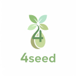
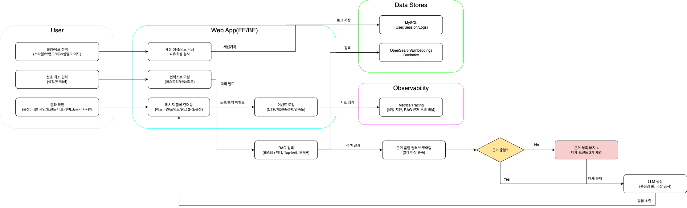
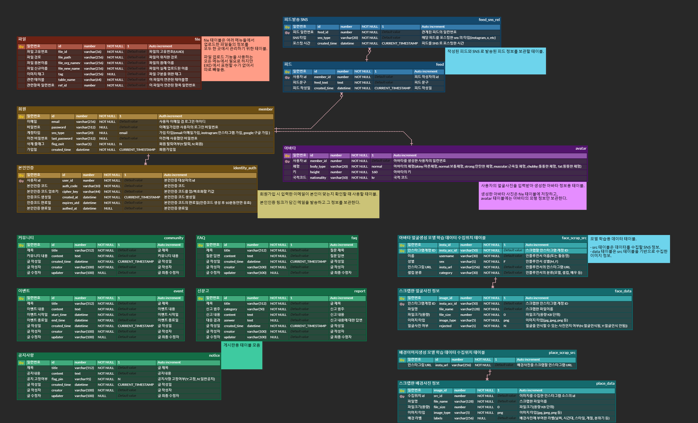

# 🌱 SK네트웍스 Family AI과정 14기 4팀 프로젝트 기획서

## 🎯 주제 :: LLM 활용 인공지능 인플루언서
LLM/RAG 기반으로 홍진경 페르소나가 **친환경 패션 브랜드의 공식 출처를 인용해 스타일을 추천**하고  
**친환경 소비 가이드를 제공**하는 대화형 서비스

 

## 📅 프로젝트 기간
┌─ **2025.8.11** : 주제 회의 및 기획  
├  
├─ **2025.8.19** : 멘토링 이후 주제 전환을 위한 회의  
├  
├─ **2025.8.21** : 주제 변경 및 기획문서들 수정  
├    
├─ **2025.8.26** : 중간 발표  
├    
└─ **2025.10.2** ( 최종발표 )

## 👥 팀 소개 :: 4-Seed
| 4-Seed | 공지환                | 송지훈                | 윤이서                | 조성렬(PM)            |
|:-----------------------:|:-----------------------:|:-----------------------:|:-----------------------:|:-----------------------:|
|  |  |  |  |  |

 

## 🔎 개발 배경

### 1️⃣ 시장 분석
- `기후감수성`              : 환경 문제에 대하여 2030 세대가 갖는 인식의 변화 [[ 출처 ]](http://news-j.co.kr/View.aspx?No=3489567)
- `지속가능 패션 시장 성장` : 글로벌 친환경 패션 시장 규모 2025년 13억 달러 → 2032년 53억 달러 전망 [[ 출처 ]](https://www.coherentmarketinsights.com/industry-reports/global-sustainable-fashion-market)
- `MZ세대 트렌드`           : 브랜드 충성도보다 가치소비·지속가능성을 우선시 [[ 출처 ]](https://www.k-trendynews.com/news/articleView.html?idxno=176226#:~:text=%5BKtN%20%EC%B5%9C%EC%9C%A0%EC%8B%9D%EA%B8%B0%EC%9E%90%5D%20MZ%EC%84%B8%EB%8C%80(%EB%B0%80%EB%A0%88%EB%8B%88%EC%96%BC+Z%EC%84%B8%EB%8C%80)%EA%B0%80%20%EC%86%8C%EB%B9%84%20%EC%8B%9C%EC%9E%A5%EC%9D%98%20%EC%A3%BC%EC%9A%94%20%EC%A3%BC%EC%B2%B4%EB%A1%9C,%EC%82%AC%ED%9A%8C%EA%B0%80%20%EC%A3%BC%EB%AA%A9%ED%95%B4%EC%95%BC%20%ED%95%A0%20%EB%B3%80%ED%99%94%EC%9D%98%20%ED%9D%90%EB%A6%84%EC%9C%BC%EB%A1%9C%20%EC%9E%90%EB%A6%AC%20%EC%9E%A1%EC%95%98%EB%8B%A4.)
- `패션+AI 융합`            : AI 기반 스타일 추천 시장과 ESG 경영 확산이 동시에 부상 [[ 출처 ]](https://seochocnc.com/53/?bmode=view&idx=165508709)

### 2️⃣ 문제 정의
- 온난화, 각국의 이상기후 등 `환경 문제에 대한 위기감 증가`
- 환경 문제에 대응하기 위한 각 `기업/브랜드의 지속가능 경영에 대한 관심도` 증가  
- 소비자는 브랜드의 `“지속가능성” 정보를 쉽게 확인/비교하기 어려움`  
- 패션 스타일 추천 서비스는 많지만 출처/근거가 뒷받침되는 `환경적 가치를 반영한 추천은 드묾`

### 3️⃣ 문제 해결 필요성
- LLM + RAG로 `브랜드 공식 지속가능성 보고서/인증 데이터를 즉시 인용`
- 국내 유명 모델 겸 방송인 홍진경 페르소나의 톤앤매너로 `개인 맞춤형 추천+가이드를 간편 대화형으로 제공`
- 소비자가 `패션 선택과 동시에 친환경적 가치 실현 가능`

 

## 제안 서비스 소개

<table>
  <thead>
    <tr>
      <th scope="col" style="background-color:lightgray;color:black;width: 160px;">구분</th>
      <th scope="col" style="background-color:lightgray;color:black;">내용</th>
    </tr>
  </thead>
  <tbody>
    <tr>
      <th style="background-color:lightgray;color:black;" scope="row">1. 서비스명</th>
      <td><ul><li><strong>SustainablePick</strong> (가칭)</li></ul></td>
    </tr>
    <tr>
      <th style="background-color:lightgray;color:black;" scope="row">2. 서비스 목적</th>
      <td>
        <ul>
          <li>브랜드 친환경 근거를 ‘**보여주고**(Show Evidence)’, 스타일을 ‘**권하는**(Recommend)’ 대화형 서비스</li>
          <li>출처가 달린 추천으로 그린워싱 리스크 최소화. 
              (그린워싱: 기업이 실제로는 환경에 해로운 활동을 하면서도 마치 친환경적인 것처럼 홍보하여 소비자를 속이는 행위)</li>
        </ul>
      </td>
    </tr>
    <tr>
      <th style="background-color:lightgray;color:black;" scope="row">3. 핵심 타겟</th>
      <td>
        <ul>
          <li><strong>B2C</strong>: 가치 소비 및 패션 관심 사용자</li>
          <li><strong>B2B</strong>: ESG 마케팅 관심 브랜드</li>
        </ul>
      </td>
    </tr>
    <tr>
      <th style="background-color:lightgray;color:black;" scope="row">4. 주요 기능</th>
      <td>
        <ol>
          <li>
            <strong>대화형 추천(LLM)</strong>
            <ul>
              <li>사용자 선호(톤/상황/색상) 입력 → 캡션/설명 생성</li>
            </ul>
          </li>
          <li>
            <strong>근거 제시(RAG)</strong>
            <ul>
              <li>브랜드 보고서/인증을 하이라이트 블록+링크 제공(최소 2개)</li>
            </ul>
          </li>
          <li>
            <strong>친환경 포인트 배지</strong>
            <ul>
              <li>소재/인증/임팩트 요약(간단 점수 또는 강점 3개)</li>
            </ul>
          </li>
          <li>
            <strong>홍진경 페르소나 톤</strong>
            <ul>
              <li>재치 있고 명확한 에디토리얼 코멘트(가이드라인 적용)</li>
            </ul>
          </li>
          <li>
            <strong>공유용 카드 → MVP 범위에서 제외(Phase 2)</strong>
            <ul>
              <li>웹에서 즉시 공유(링크/썸네일)</li>
              <li>자동 SNS 업로드</li>
            </ul>
          </li>
        </ol>
      </td>
    </tr>
    <tr>
      <th style="background-color:lightgray;color:black;" scope="row">5. 유사 서비스 및 차별점</th>
      <td style="padding:0;">
        <table style="width:100%; margin:0;">
          <thead>
            <tr>
              <th style="background-color:#90d0ff;color:black;">서비스명</th><th style="background-color:#90d0ff;color:black;">특징</th><th style="background-color:#90d0ff;color:black;">한계점</th>
            </tr>
          </thead>
          <tbody>
            <tr>
              <th style="background-color:#90d0ff;color:black;"><a href="https://www.instagram.com/stellamccartney/">Stella McCartney</a></th>
              <td>브랜드 자체 가상 인플루언서, 친환경 메시지 발신</td>
              <td style="color:#ff2222;">특정 브랜드 홍보에 한정</td>
            </tr>
            <tr>
              <th style="background-color:#90d0ff;color:black;"><a href="https://www.instagram.com/lilmiquela/">Imma, Lil Miquela</a></th>
              <td>SNS에서 활동하는 유명 가상 인플루언서</td>
              <td style="color:#ff2222;">사회적 메시지보다 패션/광고 중심</td>
            </tr>
            <tr>
              <th style="background-color:#90d0ff;color:black;"><a href="https://goodonyou.eco/">Good On You</a></th>
              <td>패션 브랜드 지속가능성 평가 앱</td>
              <td style="color:#ff2222;">검색형 정보 제공, 인플루언서 캐릭터/스토리 부족</td>
            </tr>
            <tr>
              <th style="background-color:#90d0ff;color:black;"><a href="https://www.fashionrevolution.org/fashion-transparency-index/">Fashion Transparency Index</a></th>
              <td>글로벌 브랜드 지속가능성 점수 공개</td>
              <td style="color:#ff2222;">보고서 기반, 소비자 친화 UX 부족</td>
            </tr>
          </tbody>
        </table>
         
        <ul><li>차별점: 근거+추천을 동시 제공하고, 유명인 페르소나 스토리텔링으로 전달력 강화</li></ul>
      </td>
    </tr>
    <tr>
      <th style="background-color:lightgray;color:black;" scope="row">7. 서비스 플로우차트</th>
      <td></td>
    </tr>
  </tbody>
</table>

 

## 🔧 기술스택
| **Category**         | **Tech Stack**                                                                                                                                                                                                                                                                                     |
|----------------------|----------------------------------------------------------------------------------------------------------------------------------------------------------------------------------------------------------------------------------------------------------------------------------------------------|
| **Frontend**         |    |
| **Backend Framework**|                                                                            |
| **Server / Proxy**   |                                                                                                                                                                                              |
| **Database**         |                                                                                                                                                                                            |
| **Container / DevOps**|                                                                                                                                                                                         |
| **LLM Model**        |                                                                                                                                     |
| **Vector DB**        |                                                                                                                                                                                       |
| **Collaboration**    |     |
| **IDE / Editor**     |                                                                      |
| **Infrastructure** |  |

## 🎛️ 시스템 아키텍쳐

## 🖼️ ERD

## 🎯 프로젝트 목표 및 범위

### 📌 프로젝트 목표

<table>
  <thead>
    <tr>
      <th scope="col" style="background-color:lightgray;color:black;width: 120px;">구분</th>
      <th scope="col" style="background-color:lightgray;color:black;" colspan="2">목표</th>
    </tr>
  </thead>
  <tbody>
    <tr>
      <th style="background-color:lightgray;color:black;" scope="row">정성적 목표</th>
      <td colspan="2">근거 기반 추천 UX로 신뢰/재방문 확보.</td>
    </tr>
    <tr>
      <th style="background-color:lightgray;color:black;" scope="row">정량적 목표</th>
      <td colspan="2">
        <ul>
          <li>MVP 3개월 내 300명 가입</li>
          <li>근거 블록 클릭률 25% 이상</li>
          <li>세션당 체류 2분 이상 (or 세션당 평균 4~6턴)</li>
          <li>사용자 만족도(Thumbs Up) 80% 이상</li>
        </ul>
      </td>
    </tr>
    <tr>
      <th style="background-color:lightgray;color:black;" scope="row" rowspan="3">모델 성능 목표</th>
      <td style="width:120px;">모델 정확도</td>
      <td>
        <ul>
          <li>근거 부족 응답 비율 10% 미만</li>
        </ul>
      </td>
    </tr>
    <tr>
      <td>모델 응답시간</td>
      <td>
        <ul>
          <li>사용자 입력 후 20~30초 이내 응답</li>
        </ul>
      </td>
    </tr>
    <tr>
      <td>시스템 안정성</td>
      <td>
        <ul>
          <li>95% 이상 가용성</li>
        </ul>
      </td>
    </tr>
  </tbody>
</table>

### 📌 개발 범위

- 데이터
  - 브랜드 20~30개의 지속가능성 보고서 링크(PDF/HTML)
  - 인증 사전(GOTS, FSC, Fair Trade, PETA 등)
  - 소재 사전(재활용 폴리·유기농 면 등)
  - 팩트 테이블(주요 수치/년도/출처 URL)
  - 인덱싱 포맷: {brand, year, section, claim, metric, source_url}

- 모델
  - LLM: GPT-4 계열
  - RAG: OpenSearch/Elastic(Hybrid: BM25+벡터), 청크(문단/표 기준), Top-k=5, MMR 0.6.
  - 프롬프트 템플릿
    - System: “근거 우선, 과장 금지, 링크 2개 이상, 친환경 포인트 3가지 요약”
    - Style: “홍진경 톤: 재치, 분명, 과장없음, 실용팁”

- UX 플로우
  - 온보딩 라이트
    - 목표(빠른 버튼): ① 스타일 추천 ② 브랜드 소개 ③ 브랜드 비교 ④ 소재·인증 설명 ⑤ 친환경 소비 가이드
    - 선호 최소입력(톤/상황/색상)
      - 출력 예시
        - “오늘은 출근 룩, 미니멀 톤, 네이비/화이트 선호로 이해했어요. 맞나요?”  
          버튼: [맞아요] / [수정하기]
  - 스타일 추천
    - 입력: 상황/톤/색상
    - 처리: RAG로 브랜드 근거 탐색 →  LLM이 코디 제안 + 친환경 포인트 3가지 요약
    - 대화 출력(메시지 블록)
      - 추천 요약 2줄
      - 친환경 포인트 3가지(소재/인증/임팩트)
      - 출처 링크 2개 이상(브랜드 보고서/인증 페이지)
      - 후속 버튼: [다른 제안] [브랜드 더 보기] [근거 자세히]
  - 브랜드 소개
    - 입력: 브랜드명
    - 처리: RAG로 최신 보고서/FAQ/인증 인용
    - 출력: “브랜드 핵심 친환경 포인트 3가지 + 수치 1~2개 + 링크 2개”
    - 버튼: [이 브랜드로 스타일 추천] [다른 브랜드 비교]
  - 브랜드 비교
    - 입력: 브랜드 A vs B
    - 처리: 공통 지표(소재/인증/탄소,물 등 임팩트) 정렬 요약
    - 출력: 차이점 3가지 + “어떤 상황에 어떤 브랜드가 유리한지” 한 줄 결론 + 링크 2개 이상
  - 소재/인증 설명 플로우
    - 입력: “GOTS가 뭐야?”, “재활용 폴리 위험성?”
    - 처리: 표준/공식 문서 인용
    - 출력: 정의/요건/주의사항 3줄 요약 + 링크
  - 친환경 소비 가이드
    - 입력: “여름 출근용 친환경 기본템?”
    - 출력: 체크리스트 5개(세탁/수선/소재 우선순위 등) + 근거 링크
- 로깅/측정
  - 근거 클릭률(CTR), 대화 유지율(세션당 4턴 이상 비율), 의도 전환율, 만족도(Thumbs Up/Down)

 

## 🌍 기대효과

### 👤 사용자 측
1. 신뢰성 향상: 모든 답변에 공식 출처 링크 제시 → 그린워싱 우려 감소  
2. 탐색 비용 절감: 보고서 및 인증 문서를 직접 찾지 않아도 3줄 요약+링크로 빠른 이해  
3. 결정 품질 개선: 상황/톤/색상 중심의 간결 질의 → 즉시 추천  

### 🏢 브랜드/산업 측
1. 투명성 제고: ESG 지표를 소비자 친화 언어로 중계  
2. 공식 자료 재활용 가치 증대: 보고서의 “읽히지 않는 데이터”가 구매 전 정보로 전환  
3. 대화형 피드백 루프: 어떤 근거가 클릭/공감 받는지 데이터 획득 → 향후 커뮤니케이션 개선  
